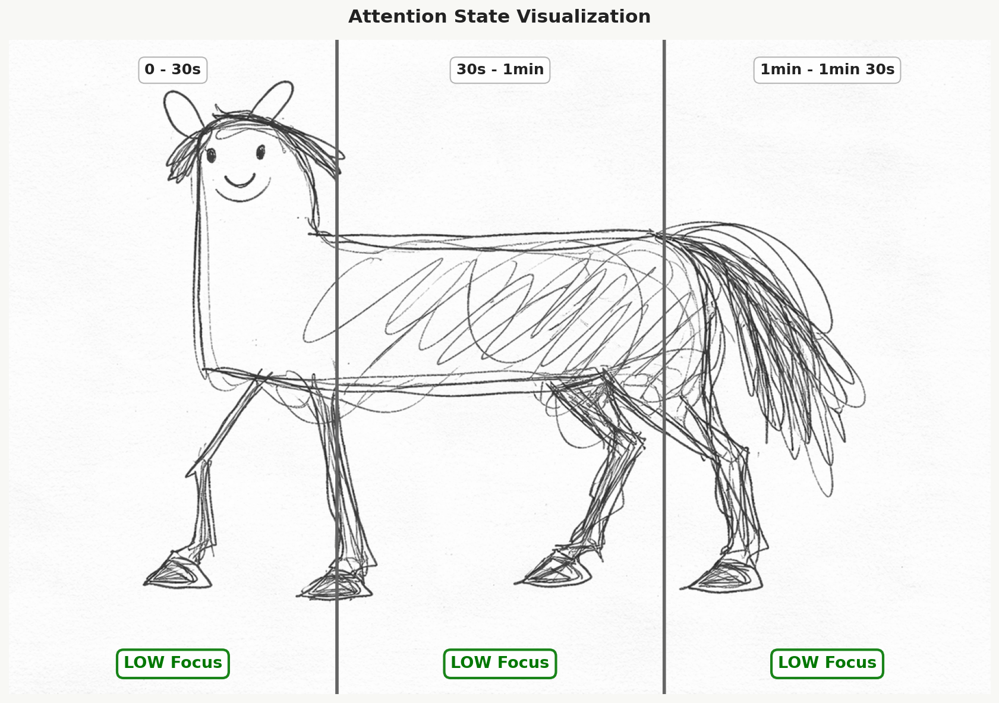
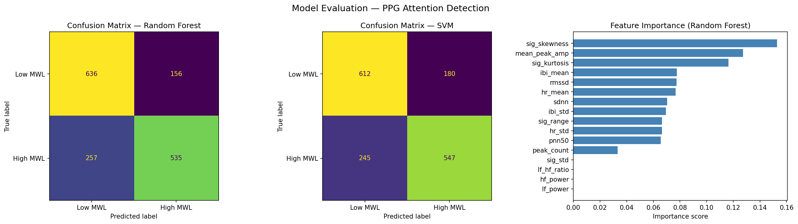

# PPG-Based Attention State Detection

##### Authors: Sijia Shao · Yuang Liu

Real-time mental workload classification using a photoplethysmography (PPG) finger sensor, ESP32-C3 microcontroller, and a Random Forest classifier. Attention state is visualized through an expressive horse memes, sketchy for low focus, detailed for high focus.



---

## How It Works

A pulse sensor on the fingertip captures blood volume changes at 256Hz. The ESP32-C3 streams raw ADC values over serial to a Python pipeline that extracts 16 heart rate variability (HRV) and morphological features from each 30-second window. A trained Random Forest model classifies each window as **Low MWL** (relaxed) or **High MWL** (cognitively engaged). After 3 rounds, the result is displayed as a composite horse image split into three sections — each section reflects the attention state of that time period.

---

## Pipeline

```
Sensor (256Hz) → Bandpass Filter (0.5–5Hz) → Peak Detection
→ IBI Extraction → 16 Features → Random Forest → Horse memes Visualization
```

---

## Repository Structure

```
PPG/
├── src/
│   └── main.cpp               # ESP32-C3 firmware (PlatformIO)
├── platformio.ini             # PlatformIO config (seeed_xiao_esp32c3)
├── capture_ppg.py             # Capture raw PPG signal to CSV
├── step1_extract_features.py  # Extract 16 features from Kaggle dataset
├── step2_train_model.py       # Train Random Forest, save model.pkl
├── step3_realtime_predict.py  # Real-time prediction + horse visualization
├── step_results.py            # Evaluation: CV accuracy, confusion matrix, feature importance
├── model.pkl                  # Trained Random Forest model
├── sketchy_horse.png          # Horse illustration — low attention
├── detailed_horse.png         # Horse illustration — high attention
└── README.md
```

---

## Hardware

| Component | Details |
|-----------|---------|
| MCU | Seeed XIAO ESP32-C3 |
| Sensor | Analog pulse sensor (KY-039 style) |
| Sampling rate | 256 Hz |
| Connection | GND→GND, VCC→3V3, A0→GPIO2 |

---

## Dataset

Training data from the [Kaggle MAUS PPG Dataset](https://www.kaggle.com/datasets/krishd123/ppg-collection-for-cognitive-strain/data):

- 22 participants
- Low MWL: 0-back task / High MWL: 3-back task
- 256 Hz, ~5 min per session
- 1584 windows extracted (30s window, 15s step, 50% overlap)

---

## Features (16 total)

| Category | Features |
|----------|---------|
| Heart Rate | `hr_mean`, `hr_std` |
| IBI / HRV | `ibi_mean`, `ibi_std`, `rmssd`, `sdnn`, `pnn50` |
| Frequency Domain | `lf_power`, `hf_power`, `lf_hf_ratio` |
| Morphology | `peak_count`, `mean_peak_amp`, `sig_std`, `sig_range`, `sig_skewness`, `sig_kurtosis` |

Top features by importance: `sig_skewness` (15.3%), `mean_peak_amp` (12.7%), `sig_kurtosis` (11.6%)

---

## Model Performance

**Dataset:** 1584 windows · 22 participants · 792 Low MWL / 792 High MWL · 30s window @ 256Hz · 15s step (50% overlap)

**5-Fold Cross-Validation**

| Model | Accuracy | F1 Score |
|-------|----------|----------|
| Random Forest | 0.7393 ± 0.0138 | 0.7216 ± 0.0108 |
| SVM (RBF) | 0.7317 ± 0.0237 | 0.7199 ± 0.0255 |

**Random Forest — Classification Report**

|  | Precision | Recall | F1 | Support |
|--|-----------|--------|----|---------|
| Low MWL | 0.71 | 0.80 | 0.75 | 792 |
| High MWL | 0.77 | 0.68 | 0.72 | 792 |
| accuracy | | | 0.74 | 1584 |
| macro avg | 0.74 | 0.74 | 0.74 | 1584 |
| weighted avg | 0.74 | 0.74 | 0.74 | 1584 |

5-fold stratified cross-validation on 1584 windows from 22 participants.




---

## Setup

### 1. Firmware

Install [PlatformIO](https://platformio.org/), then:

```bash
pio run --target upload
```

### 2. Python Dependencies

```bash
pip install numpy pandas matplotlib scikit-learn scipy joblib pyserial Pillow
```

### 3. Collect Training Data (optional)

```bash
python3 capture_ppg.py --duration 60 --output my_ppg.csv
```

### 4. Extract Features

```bash
python3 step1_extract_features.py --low_dir ./Low_MWL --high_dir ./High_MWL \
  --output features_dataset.csv
```

### 5. Train Model

```bash
python3 step2_train_model.py --data features_dataset.csv --output model.pkl
```

### 6. Real-Time Prediction

```bash
python3 step3_realtime_predict.py --model model.pkl --rounds 3
```

Place finger on sensor and keep still for each 30-second round. After 3 rounds, a horse visualization is generated automatically.

### 7. Evaluate Model

```bash
python3 step_results.py --data features_dataset.csv
```

---

## Visualization

The horse memes image is split into 3 vertical sections corresponding to each round:

- **LOW Focus** → sketchy horse (low cognitive load)
- **HIGH Focus** → detailed horse (high cognitive load)

| Time | Section |
|------|---------|
| 0 – 30s | Left (head) |
| 30s – 1min | Middle (body) |
| 1min – 1min 30s | Right (rear) |


